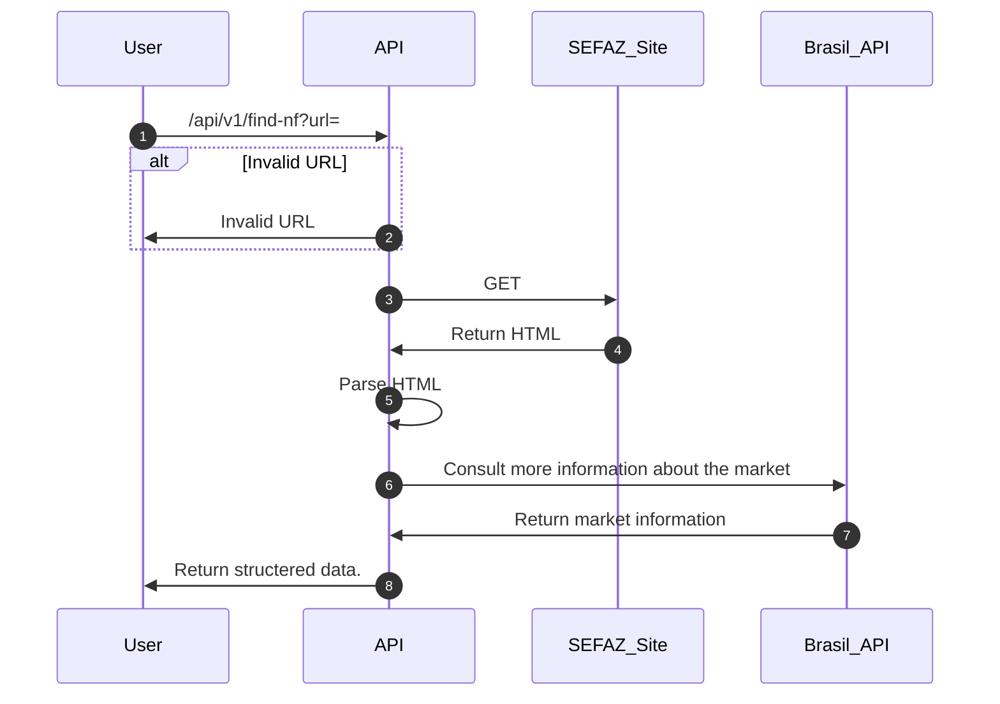

# What i bought

> This is a project where i'm applying some concepts using C#/.NET to challenge my knowledge with its ecosystem.

## How Works?

The context of this application: In Brasil whenever we bought some product at market a digital document is emitted  where i can consult later to see what was bought, the payment method and the location.

The idea is to have an API to consult the website gather the information of the products bought, such as price, name, quantity and store these information for later processing such as creating reports.

### Diagram

### What is being applied to this repository
    - Gateway Pattern
    - S.O.L.I.D
    - Layered Architecture
    - WebCrawling
    - Communication Between External Services
    - Docker
    - WebAPI
    - AutoDeploy on Render
    - CI/CD - Update docker image on registry(Docker hub)
    - Rate Limiting (From .NET 7 middleware)
    - Options Pattern (Working on it)
    - Structured Logging  - Serilog With Seq (Working on it, needs to improve the DI)

 ### What will be applied
    - Unit Testing
    - Integration Testing 
    - Repository Pattern
    - Unit Of Work
    - CI/CD
    - Caching
